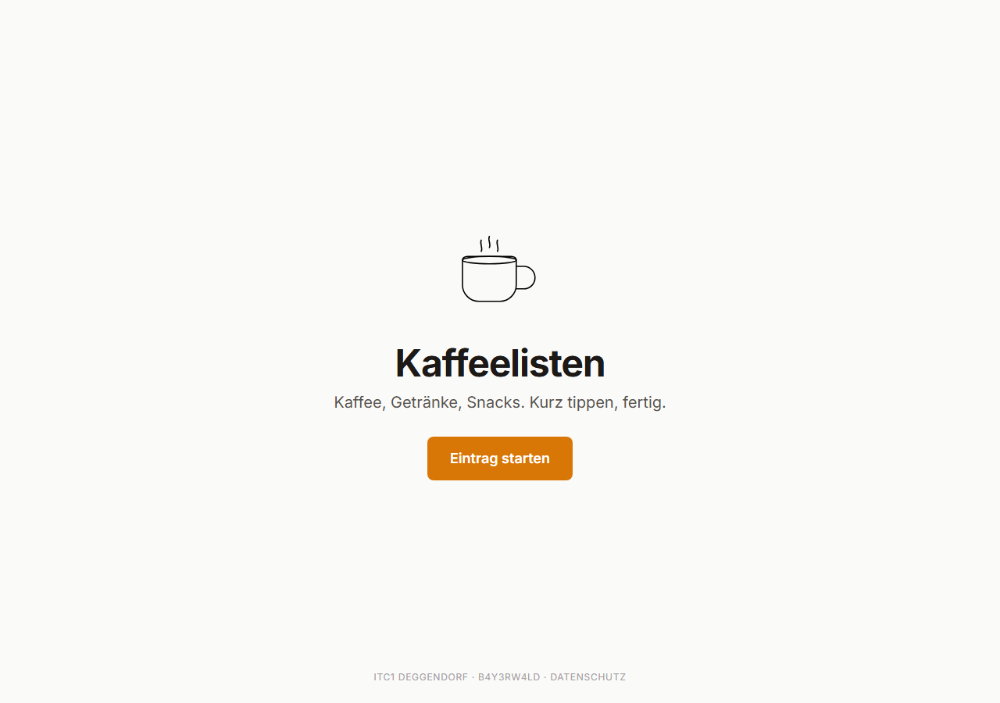
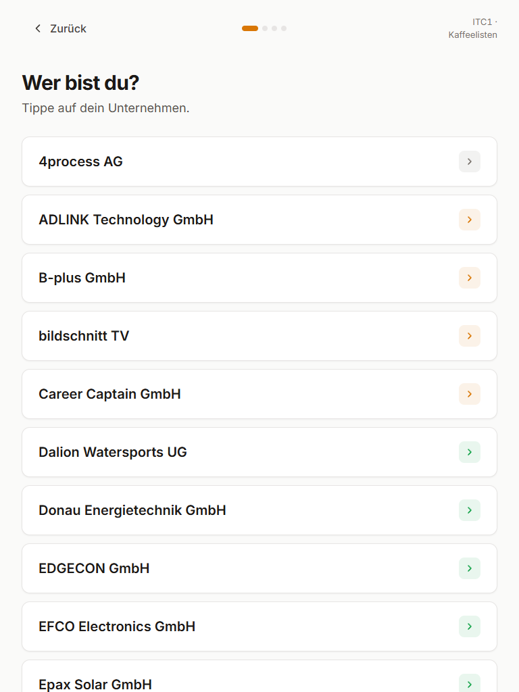
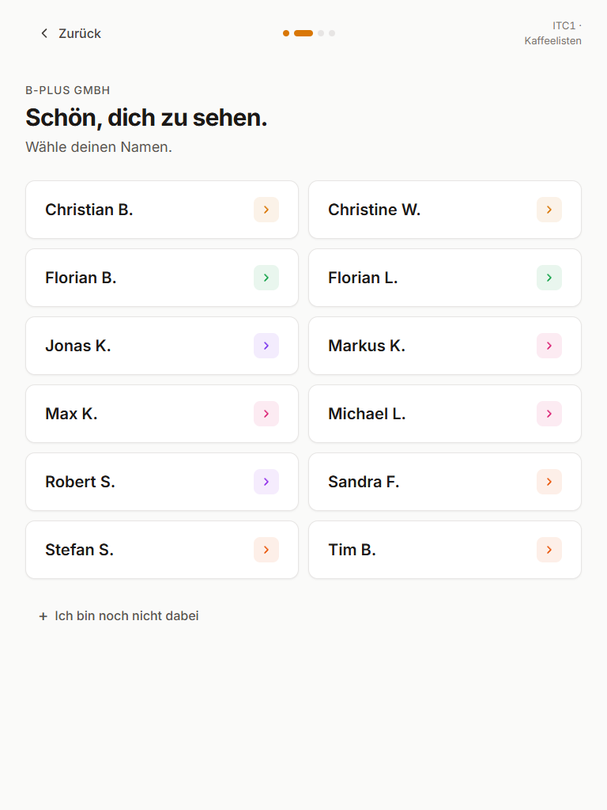
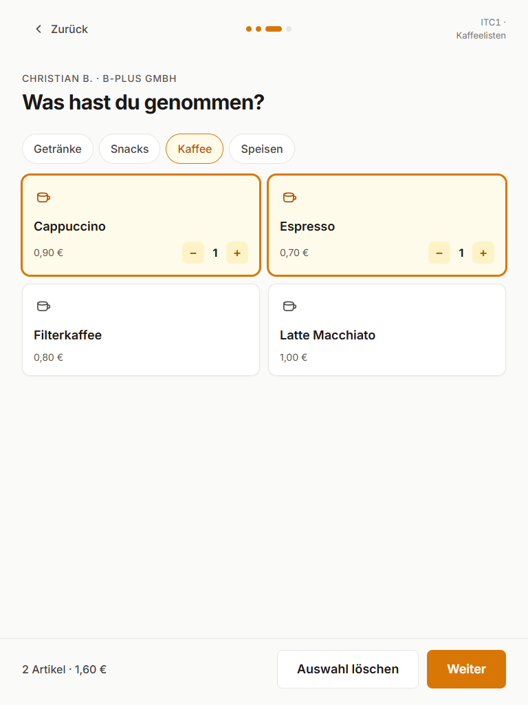
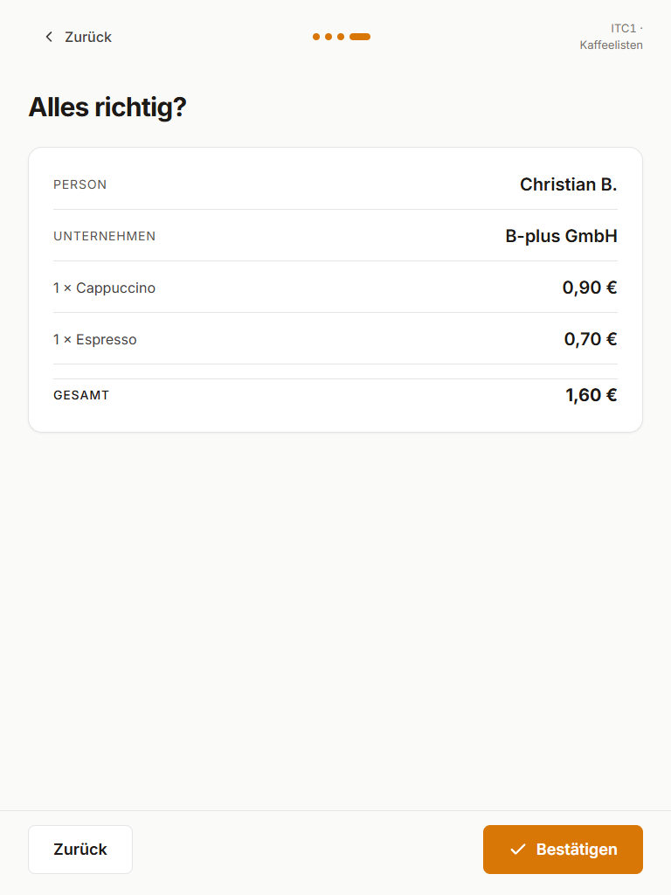
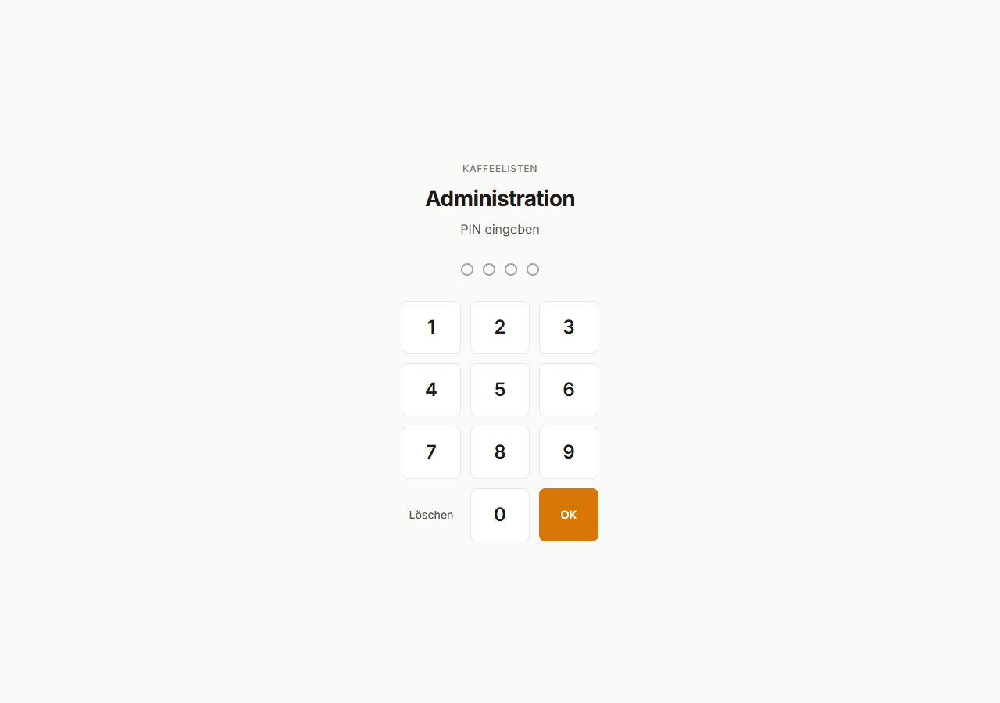
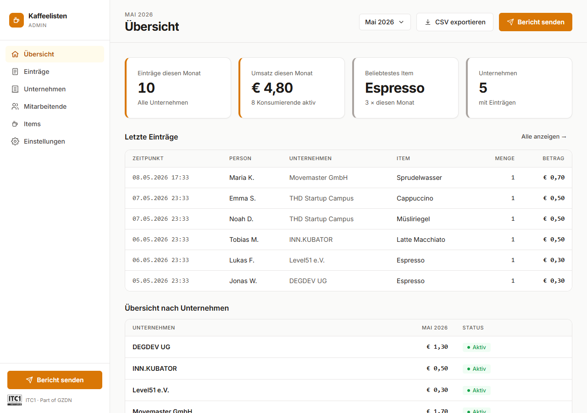
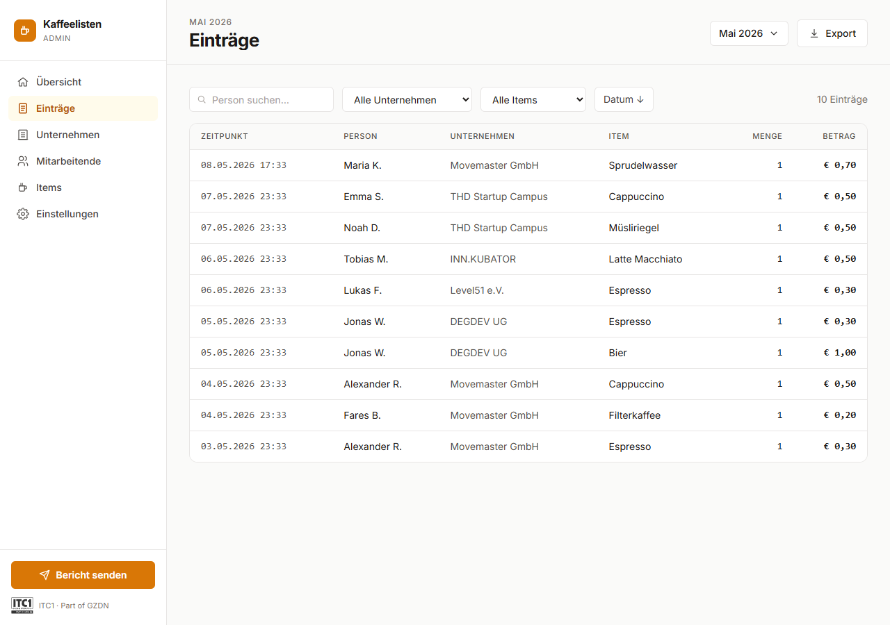

# Kaffeelisten

Kaffeelisten is a live digital coffee and snack log for shared campus spaces.
It replaces the paper sheet on the wall with a fast PWA flow for members and a
PIN-protected admin panel for monthly reporting.

Built by **HuggyWuggies** for the
[B4Y3RW4LD Hackathon](https://www.bayerwald-hackathon.de/) at
[ITC1 Deggendorf](https://www.itc-deggendorf.de/).

**Live app:** [kaffeelisten.vercel.app](https://kaffeelisten.vercel.app)  
**Pitch deck:** [arudaev.github.io/kaffeelisten](https://arudaev.github.io/kaffeelisten/)

## What It Does

Members use the wall-mounted iPad or any browser:

1. Pick a company.
2. Pick their name.
3. Pick coffee, drinks, snacks, or food.
4. Confirm the entry.

No account. No password. No app store. The target interaction is under 15
seconds from cup to saved transaction.

Admins use `/admin`:

- View month-to-date transactions.
- Filter and inspect entries.
- Manage companies, members, and items.
- Export CSV.
- Send the monthly report manually.
- Let Vercel Cron send the report automatically at month end.

The report flow generates a PDF and Excel workbook, emails them via Resend,
archives the live transactions, and resets the current-month table.

## Screenshots

### Landing

<a href="https://kaffeelisten.vercel.app">
  
</a>

### Member Flow

<table>
  <tr>
    <td></td>
    <td></td>
    <td></td>
    <td></td>
  </tr>
  <tr>
    <td align="center">Company</td>
    <td align="center">Member</td>
    <td align="center">Items</td>
    <td align="center">Confirmation</td>
  </tr>
</table>

### Admin Panel

<table>
  <tr>
    <td></td>
    <td></td>
  </tr>
  <tr>
    <td align="center">PIN login</td>
    <td align="center">Dashboard</td>
  </tr>
  <tr>
    <td colspan="2"></td>
  </tr>
  <tr>
    <td colspan="2" align="center">Transaction log</td>
  </tr>
</table>

## Stack

| Layer | Tech |
| --- | --- |
| Frontend | React 18, TypeScript, Vite, Tailwind CSS |
| PWA | vite-plugin-pwa, Workbox |
| Database | Supabase, PostgreSQL, RLS |
| Hosting | Vercel, Serverless Functions, Cron |
| Reports | Puppeteer, ExcelJS |
| Email | Resend |

## Project Structure

```text
apps/web/
  src/                 React app: member flow, admin panel, privacy page
  api/                 Vercel functions: PIN check, report send, cron
  public/              App icons, illustrations, PWA assets
docs/
  index.html           Pitch deck
  design-*.md          Visual system and design notes
  prd.md               Product requirements
  roadmap.md           Future phases
supabase/
  migrations/          Schema, grants, RLS policies
  seeds/               ITC1 seed data
scripts/, tools/       Utility scripts
```

## Local Development

Requires Node.js 24 or newer.

```bash
npm install
cp apps/web/.env.example apps/web/.env.local
# fill apps/web/.env.local using the table below
npm run dev
```

The Vite app runs at `http://localhost:5173`.

For local API testing, run Vercel from the web app directory:

```bash
cd apps/web
npx vercel dev
```

Useful root commands:

```bash
npm run build
npm run typecheck
npm run lint
```

## Environment Variables

Client-side variables must use the `VITE_` prefix. Server-only variables must
not use that prefix.

| Variable | Used by | Notes |
| --- | --- | --- |
| `VITE_SUPABASE_URL` | client + server | Supabase project URL |
| `VITE_SUPABASE_ANON_KEY` | client | Public anon key for RLS-protected reads/inserts |
| `SUPABASE_SERVICE_ROLE_KEY` | server | Required for reports, archive, and reset |
| `RESEND_API_KEY` | server | Sends monthly report email |
| `ADMIN_EMAIL` | server | Report recipient |
| `ADMIN_PIN` | server | PIN for `/admin` |
| `CRON_SECRET` | server | Bearer token for `/api/cron/monthly-report` |
| `CHROMIUM_PATH` | server, optional | Local/custom Chromium path for PDF rendering |

## Database Setup

Create a Supabase project, then apply the SQL files in `supabase/migrations/`
in numeric order.

Current migrations:

```text
001_initial_schema.sql
002_grant_table_permissions.sql
003_anon_read_transactions.sql
004_anon_insert_members.sql
005_admin_crud_policies.sql
006_service_role_grants.sql
007_member_work_email.sql
009_fix_member_rls_update.sql
```

Optional seed data lives in `supabase/seeds/002_demo_data.sql`.

## Data Model

```text
companies
members
items
transactions
transactions_archive
```

The browser uses the Supabase anon key with RLS. Service-role access is limited
to Vercel serverless functions for admin-only reporting, archiving, and monthly
reset behavior.

## Reporting

Manual report:

```text
POST /api/send-report
Header: x-admin-pin: <ADMIN_PIN>
Body: { "month": "YYYY-MM" }    # optional
```

Automatic report:

```text
GET /api/cron/monthly-report
Header: Authorization: Bearer <CRON_SECRET>
```

Vercel schedules the cron on days 28-31 at 22:00 UTC. The function only runs
the report when that day is the actual last day of the month.

## Deployment

The production app is designed for Vercel with `apps/web` as the project root.

1. Create/configure Supabase.
2. Apply migrations.
3. Add the environment variables in Vercel.
4. Deploy `apps/web`.

The app is a PWA, so the live URL can be installed on an iPad and used as the
wall-mounted member terminal.

## Documentation

- [Product requirements](docs/prd.md)
- [Domain model](docs/domain.md)
- [Design foundation](docs/design-foundation.md)
- [Design system](docs/design-system.md)
- [Roadmap](docs/roadmap.md)
- [Pitch deck](https://arudaev.github.io/kaffeelisten/)

## License

Copyright 2026 HuggyWuggies. Licensed under the
[Apache License 2.0](LICENSE).

This license applies to the source code in this repository. Third-party names,
logos, and event or campus branding, including ITC1 Deggendorf and B4Y3RW4LD
Hackathon references, remain the property of their respective owners.
