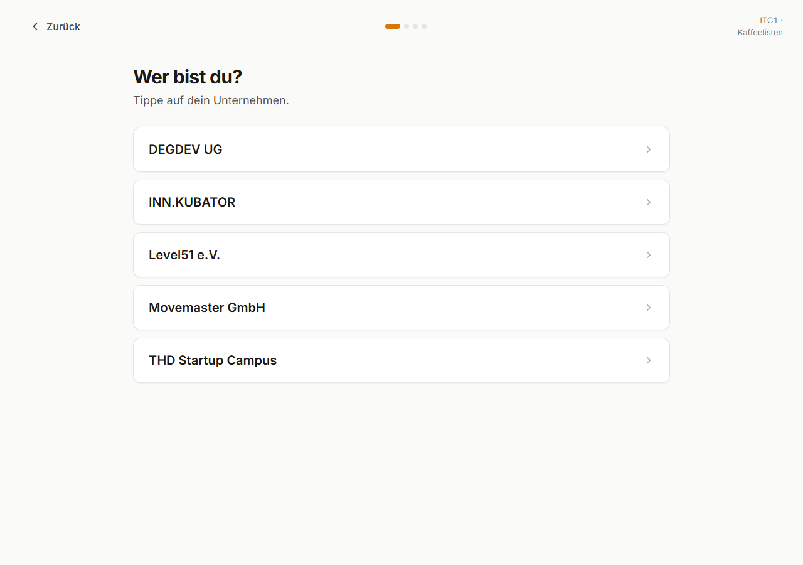
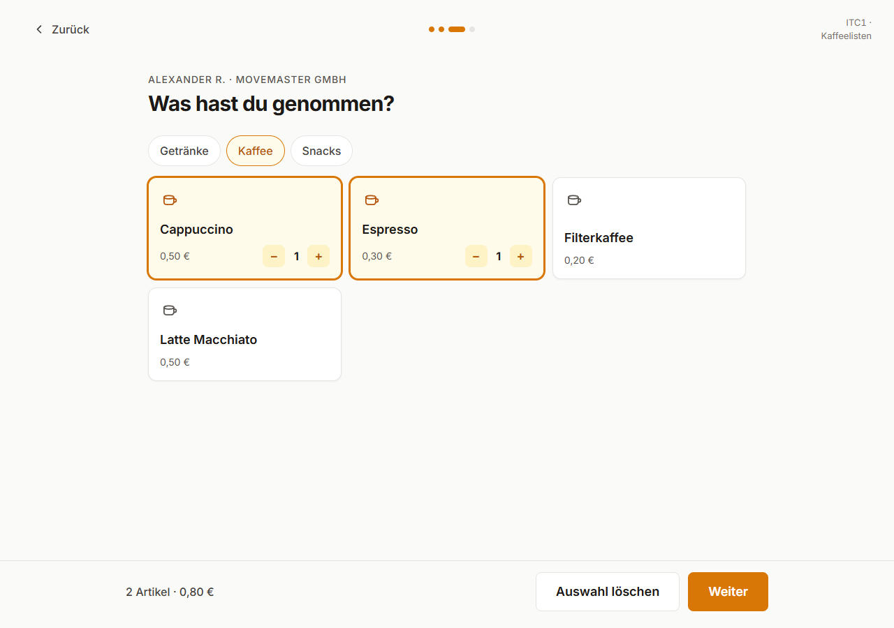
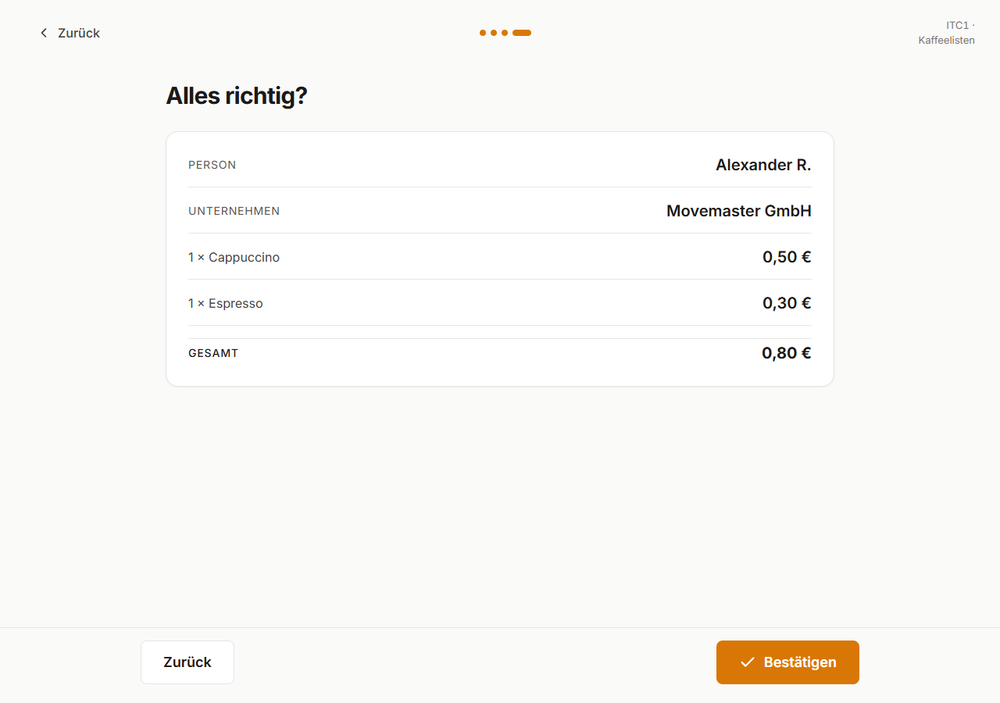

# Kaffeelisten

Digital coffee and snack consumption logger for ITC1 Deggendorf campus.

Replaces the paper sheet on the wall. Campus members log what they consumed in a few taps. The admin gets a formatted monthly email report, then the database resets.

Built for the **Kaffeelisten Challenge ITC1** at [B4Y3RW4LD Hackathon](https://www.bayerwald-hackathon.de/), May 8–9 2026, by team **HuggyWuggies**.

---

## What it does

1. A member opens the PWA (on a mounted iPad or any browser)
2. They select their company, their name, and what they consumed
3. The transaction is logged instantly — timestamp, person, company, item
4. At month's end, the admin clicks "Send Report" (or a cron fires automatically)
5. A clean email lands in the admin inbox: every transaction grouped by company and person
6. The live table archives and resets for the next month

No accounts. No passwords. No payments. No hardware.

---

## Screenshots

### Member flow

<p>
  
  
</p>

<p>
  
  
</p>

### Admin

<p>
  
  
</p>

---

## Stack

| Layer | Tool |
|---|---|
| Frontend | React 18 + Vite + TypeScript |
| PWA | Vite PWA plugin (Workbox) |
| Styling | Tailwind CSS |
| Database | Supabase (PostgreSQL) |
| Hosting | Vercel |
| Email | Resend |
| Cron | Vercel Cron Jobs |

---

## Project structure

```
kaffeelisten/
├── apps/
│   └── web/              React PWA
│       ├── public/
│       │   └── manifest.json
│       ├── src/
│       │   ├── components/
│       │   ├── pages/
│       │   ├── lib/
│       │   └── main.tsx
│       ├── index.html
│       ├── package.json
│       └── vite.config.ts
├── supabase/
│   ├── migrations/       SQL migration files
│   └── seed.sql          Dev seed data
├── docs/
│   ├── prd.md            Product Requirements Document
│   ├── design-foundation.md
│   ├── design-system.md
│   ├── domain.md
│   ├── roadmap.md
│   ├── prompts.md
│   └── claude-design-workflow.md
├── .github/
│   ├── workflows/
│   │   ├── ci.yml
│   │   └── monthly-report.yml
│   └── ISSUE_TEMPLATE/
├── CLAUDE.md
├── CHANGELOG.md
└── package.json
```

---

## Getting started

### Prerequisites

- Node.js 20+
- A Supabase project (free tier)
- A Resend account (free tier)
- Vercel CLI (optional, for local preview)

### Environment variables

Copy `.env.example` to `.env.local` in `apps/web/`:

```
VITE_SUPABASE_URL=
VITE_SUPABASE_ANON_KEY=
RESEND_API_KEY=
ADMIN_EMAIL=
ADMIN_PIN=
```

### Install and run

```bash
npm install
npm run dev --workspace=apps/web
```

### Database setup

```bash
# Apply migrations to your Supabase project
npx supabase db push

# Seed with sample data for local dev
npx supabase db reset
```

---

## Docs

- [Product Requirements Document](docs/prd.md)
- [Design Foundation](docs/design-foundation.md)
- [Design System](docs/design-system.md)
- [Domain Model](docs/domain.md)
- [Roadmap](docs/roadmap.md)
- [Claude Design Workflow](docs/claude-design-workflow.md)

---

## License

MIT
